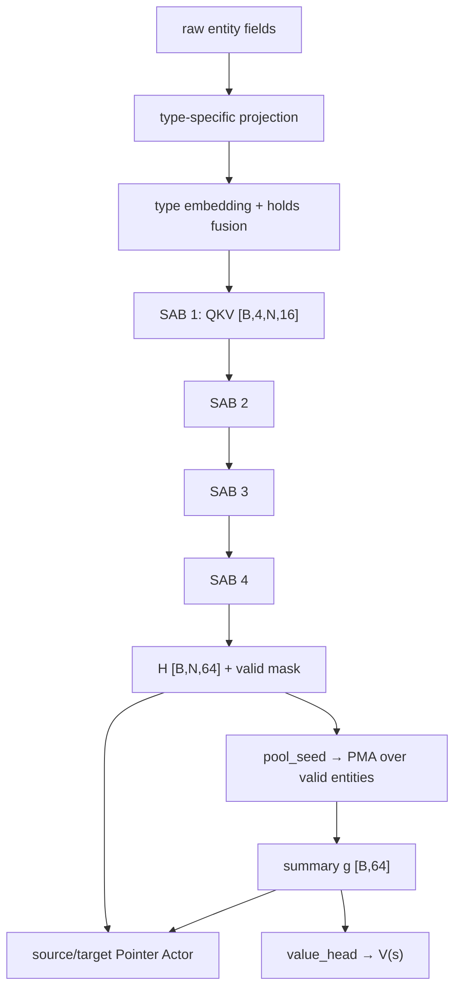
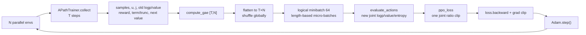

# 当前架构与端到端数据流审计

审计基线：`de951cd`（2026-09-14，本地 `main`，相对 `origin/main` ahead 4）。

审计对象：当前主线 A-path 的真实源码、当前本地 C++ 扩展、旧兼容路径及实际运行探针。

边界：本次只读审计；没有修改现有实现、没有解决用户/其他 agent 的冲突、没有清理工作树、没有启动四小时训练。唯一新增文件是本文档。审计期间另一个 agent 完成了 A-path 合入；未跟踪的 `docs/handoff-2026-09-14.md` 保留不动。

证据级别约定：

- `源码`：由当前 checkout 的文件、import 和调用关系直接确认；路径后附行号。
- `运行时`：在当前本地解释器和当前 `slaythespire` 扩展上实际执行。
- `历史/交接`：已有报告或归档中的结果，只用于界定范围，不当作本轮重新运行。
- `风险`：不一定已经造成数值错误，但会影响架构解释、可复现性、信息完整性或正式准入。

## 1. Executive Summary

### 1.1 当前真正执行的主线

当前 A-path 主线已经进入 `main`，实际入口是：

```text
python scripts/run-a-path-ppo.py --output <new-dir>
→ scripts/run-a-path-ppo.py::main
→ sts.train.apath.APathTrainer
→ sts.env.apath.APathEnv
→ sts.env.ironclad.IroncladEnv
→ sts.env.full_card_public.PublicBattleEnv
→ slaythespire.IroncladExpandedBattleEnv
→ C++ expanded public JSON
→ full_card_public / IroncladEnv normalization
→ sts.env.entities.encode_observation
→ sts.models.apath.encode
→ sts.models.apath.batch_samples
→ sts.models.apath.APathActorCritic
→ JointDistribution：来源分布 × 条件目标分布
→ APathEnv.step(route)
→ rollout
→ sts.train.ppo.compute_gae
→ sts.train.ppo.ppo_loss
→ backward / gradient clipping / Adam.step
→ 下一轮 APathTrainer.collect
```

源码证据：`scripts/run-a-path-ppo.py:20-23,136-220`、`sts/train/apath.py:14-18,55-84,86-149,151-221`、`sts/env/apath.py:60-114`。

当前运行用的 C++ 类不是旧的 `IroncladBattleEnv` 31-action 类，而是 Python 看到的 `slaythespire.IroncladExpandedBattleEnv`。它由 `third_party/sts_lightspeed/bindings/integrated-card-env.cpp:681-699` 中的 C++ `IroncladBattleEnv : public PublicBattleEnv` 注册而来。运行时扩展路径和哈希已实测为：

```text
C:\Users\19091\Desktop\sts2\third_party\sts_lightspeed\build\slaythespire.cp313-win_amd64.pyd
sha256 = 2c3256c28c5e3701e2705ec297f07017ce2f36a5230b7da682cdf78f061ea28c
```

### 1.2 关键结论

1. 当前模型输入有 5 类实体：`CARD`、`ENEMY`、`POTION`、`RELIC`、`PLAYER_GLOBAL`。A-path 的原始实体维度是 `CARD=116`、`ENEMY=774`、`POTION=21`、`RELIC=10`、`PLAYER_GLOBAL=198`，之后各自投影到 64 维。源码：`sts/models/unified-entity-contract.json:16-21,751-756`、`sts/env/entities.py:97-103`。
2. 当前 A-path 的关键转换函数不是旧 `sts.models.unified.encode`，而是 `sts.env.entities.encode_observation`，再由 `sts.models.apath.encode` 调用 `adapt` 把合法实体候选改造成两阶段来源/目标结构。源码：`sts/models/apath.py:70-92`。
3. 当前 Actor 不是 `Linear(64,66)`，也不是一次 `softmax(b_source+t_target)`。它先按 `task + source entity` 形成来源分布，再按选中的来源对合法敌人形成条件目标分布；完整动作的 log-prob 是两者相加，环境只收到一个 route。源码：`sts/models/apath.py:104-154,211-228`。
4. 当前 A-path 模型为 4 个手写 `EntityBlock` SAB，宽度 64、4 头、每头 16、FFN `64→128→64`、Pre-LN、GELU、无 dropout；PMA 的实现使用了 PyTorch `nn.MultiheadAttention`，不是手写 `Attention` 类。这一点与规格中“手写 PMA”的学习目标存在一个实现风险，详见第 19 节。
5. 当前 A-path rollout 保存的是 `ActionSample`、来源索引、目标索引、旧联合 log-prob、旧 value、reward、terminated/truncated、next value、GAE advantage、return 以及不可变 pickle；当前 collector 没有单独再保存一份原始 JSON，而是把本步的合法候选/实体/route 保存在 `ActionSample` 内。源码：`sts/train/apath.py:86-149`。
6. GAE 与 PPO 更新使用共享的 `sts/train/ppo.py`。当前默认每次 rollout 是 `8 环境 × 128 步 = 1024 transition`，每个逻辑 minibatch 64，4 个 epoch；按实体长度拆出的 micro-batch 只改变计算批次，不删实体、不改变逻辑 minibatch 的优势归一化。源码：`sts/train/apath.py:55-68,151-207`。
7. 当前未宣称学习收益。合入报告只证明工程闭环和短预检；1379 项 CPU 回归、1 项 C++ 夹具、1 项 CUDA 更新/恢复用例通过，并没有启动新的四小时训练。 `docs/a-path-main-integration-report.md:34-55`。
8. 当前训练池仍是 39 个训练内容、33 个来源关联组、2 个状态条件、5 个遭遇、390 个注册初态配置；全卡入口虽然有 44 个一二幕遭遇并保留 `MAW/TRANSIENT`，但没有自动进入 A-path 训练池。源码/数据：`sts/env/a-path-training-pool.json:46-52`、`docs/a-path-main-integration-report.md:22-30`。

### 1.3 一个重要的接口分流

用户举例的：

```python
{
    "features": ..., "kinds": ..., "ids": ..., "valid": ...,
    "sources": ..., "targets": ..., "action_types": ..., "mask": ...
}
```

确实存在，但它属于旧的 `sts/models/unified.py::encode` 66-action 路径（`sts/models/unified.py:20-91`），不是当前 A-path 的模型边界。当前 A-path `encode(obs)` 返回 `ActionSample`；进入模型后的关键 key 是 `entity_valid`、`types`、`features`、`source_index`、`task`、`source_mask`、`target_index`、`target_mask` 和 `public_context`，详见第 8 节。

## 2. 当前正式训练入口

### 2.1 当前 A-path 调用表

| 层 | 当前文件 | class/function | 是否正式路径 | 上游输入 | 下游输出 |
|---|---|---|---|---|---|
| 命令入口 | `scripts/run-a-path-ppo.py:136-220` | `main` | 是，当前主线入口 | CLI 的 output、seconds、initializations | 初始化环境、训练、评估、checkpoint、报告 |
| 训练池 | `sts/env/apath.py:21-57` | `load_pool`、`scene`、`sample_scene` | 是 | `a-path-training-pool.json`、独立 RNG | 注册场景 dict；来源组均匀、组内 deck 均匀 |
| collector/trainer | `sts/train/apath.py:55-84` | `APathTrainer.__init__`、`reset` | 是 | group、device、T、N、预算 | APathEnv 列表、模型、Adam、采样 RNG |
| rollout collector | `sts/train/apath.py:86-149` | `APathTrainer.collect` | 是 | 当前 `ActionSample` 列表 | `samples/source/target/old_logp/old_value/reward/ends/next_values` |
| 环境 admission | `sts/env/apath.py:60-93` | `APathEnv.reset` | 是 | 已注册 scene、环境 seed、purpose | expanded 规范 observation |
| 环境执行 | `sts/env/apath.py:95-114` | `APathEnv.step` | 是 | `NORMAL` 或 `SELECT_CARD` route | 下一 observation、reward、终止标志、info |
| 全卡 Python wrapper | `sts/env/ironclad.py:72-139` | `IroncladEnv._normalize_observation`、`step` | 是 | C++ JSON 结果、selection API | 带 snapshot/selection 语义的公开 dict |
| JSON wrapper 基类 | `sts/env/full_card_public.py:45-100,140-229` | `normalize_observation`、`PublicBattleEnv.reset/step` | 是，经 `IroncladEnv` 复用 | JSON dict/string | ID、排序、容量、reward 边界校验后的 dict |
| C++ binding | `third_party/sts_lightspeed/bindings/integrated-card-env.cpp:190-455,681-699` | C++ `PublicBattleEnv`、绑定名 `IroncladExpandedBattleEnv` | 是 | scene JSON、seed、normal/select action | JSON string；选择辅助方法返回 JSON/list/int |
| 实体编码 | `sts/env/entities.py:144-340` | `encode_observation` | 是 | expanded observation dict | `EntitySample(tokens, edges, candidates, routes, held_card_index)` |
| A-path 编码适配 | `sts/models/apath.py:37-72` | `adapt`、`encode` | 是 | `EntitySample` | `ActionSample`：来源、任务、条件目标、route |
| 变长 batch | `sts/models/apath.py:74-92` | `batch_samples` | 是 | ActionSample 列表 | torch batch，动态 `[B,N,U,J]` |
| Set encoder + policy/value | `sts/models/apath.py:157-230` | `APathActorCritic` | 是 | batch、source/target mask | `JointDistribution`、`V(s)` |
| 执行型 Agent | `sts/agents/apath.py:19-41` | `APathAgent.act/evaluate_actions/value_only` | 辅助正式接口；当前 trainer 直接调用模型 | observation | 采样决策、route、logp、value |
| GAE | `sts/train/ppo.py:126-157` | `compute_gae` | 是 | `[T,N]` reward/value/next-value/ends | `[T,N]` advantage、return |
| PPO objective | `sts/train/ppo.py:160-194` | `ppo_loss` | 是 | new/old logp、adv、value、return、entropy | scalar loss、监控量 |
| 更新 | `sts/train/apath.py:151-207` | `APathTrainer.update` | 是 | rollout、shuffle RNG | backward、clip、Adam.step |
| 受限运行器 | `scripts/run-a-path-ppo.py:156-216` | 每初始化训练/评估/保存 | 计划入口；本轮未启动长训 | APathTrainer | per-init checkpoint、evaluation、status/report |

### 2.2 当前真实调用链

```text
run-a-path-ppo.py::main
  → APathTrainer(group, device='cuda', num_envs=8, num_steps=128)
  → APathTrainer.reset(i)
  → sample_scene(scene_rng, 'train_candidate')
  → APathEnv.reset(registered, environment_seed, purpose='train')
  → full_card_public.PublicBattleEnv.reset(...)
  → self._env = slaythespire.IroncladExpandedBattleEnv(512)
  → C++ resetScene(scene_json, seed)
  → C++ observeJson().dump()
  → json.loads
  → IroncladEnv._normalize_observation
  → normalize_ironclad
  → full_card_public.normalize_observation
  → encode_observation
  → sts.models.apath.encode
  → adapt
  → batch_samples
  → APathActorCritic.forward
  → JointDistribution.sample(generator)
  → ActionSample.route(source, target)
  → APathEnv.step(route)
  → C++ step(int) 或 select_card(int)
  → next observation/reward/terminated/truncated
  → collect next_values
  → compute_gae
  → evaluate_actions + ppo_loss
  → loss.backward()
  → clip_grad_norm_
  → Adam.step()
```

## 3. 完整端到端数据流图

图中实线是当前 A-path；旧 `run-unified-ppo.py` 是保留的历史 66-action 路径，不接入当前 A-path collector。

```mermaid
flowchart LR
    CLI["scripts/run-a-path-ppo.py"] --> TR["APathTrainer"]
    TR --> ENVA["APathEnv"]
    ENVA --> IRON["IroncladEnv / full_card_public"]
    IRON --> CPP["slaythespire.IroncladExpandedBattleEnv"]
    CPP --> RAW["C++ JSON string"]
    RAW --> NORM["normalize_ironclad / normalize_observation"]
    NORM --> OBS["expanded public observation dict"]
    OBS --> EO["encode_observation"]
    EO --> ES["EntitySample"]
    ES --> AD["apath.encode / adapt"]
    AD --> BATCH["batch_samples: [B,N,U,J]"]
    BATCH --> SET["4 SAB + PMA"]
    SET --> AC["source pointer + target pointer + V"]
    AC --> JD["JointDistribution"]
    JD --> ROUTE["one normal/select route"]
    ROUTE --> ENVA
    TR --> GAE["compute_gae"]
    GAE --> LOSS["ppo_loss"]
    LOSS --> ADAM["backward + clip + Adam.step"]
    ADAM --> TR
    OLD["run-unified-ppo.py / UnifiedActorCritic"] -. historical .-> CPP
```



当前链路中，环境与模型的交界不是一个 Gym `Box`，而是具名 Python dict → `EntitySample` → 动态 torch dict。合法性由 C++ action mask 和 expanded selection candidate 生成；模型只在已经给出的合法候选上分配概率。

## 4. C++ → Python 边界

### 4.1 当前 A-path 使用的类和方法

| Python 看到的对象 | C++ 实际来源 | 方法 | Python 刚接收类型 |
|---|---|---|---|
| `slaythespire.IroncladExpandedBattleEnv` | `integrated-card-env.cpp` 的 expanded `IroncladBattleEnv` | 构造 `int max_actions` | pybind object |
| 同上 | `PublicBattleEnv::resetScene` | `reset_scene(scene_json: str, seed: uint64)` | Python `str`，内容是 JSON |
| 同上 | `PublicBattleEnv::step` | `step(action: int)` | Python `str`，内容是 step JSON |
| 同上 | `PublicBattleEnv::observation` | `observation()` | Python `str`，内容是 observation JSON |
| 同上 | `PublicBattleEnv::actionMask` | `action_mask()` | Python `list[bool]`，长度 66 |
| 同上 | `allocationCount` | `allocated_card_count()` | Python `int`，只用于容量/诊断 |
| 同上 | `selectionIndices` | `selection_indices()` | Python `list[int]`，只用于选择路由 |
| 同上 | `selectionCard` | `selection_card(index)` | Python `str`，一张卡的 JSON |
| 同上 | `selectCard` | `select_card(index)` | Python `str`，step JSON |

绑定注册证据：`third_party/sts_lightspeed/bindings/slaythespire.cpp:27-30` 注册三类环境；`third_party/sts_lightspeed/bindings/integrated-card-env.cpp:687-699` 注册 expanded 类；`third_party/sts_lightspeed/CMakeLists.txt:16` 把 `integrated-card-env.cpp` 编入扩展。

当前 A-path 的 Python 构造过程在 `IroncladEnv.__init__`：

```python
module = _load_backend()
super().__init__(max_actions,
    backend=SimpleNamespace(
        PublicBattleEnv=module.IroncladExpandedBattleEnv))
```

证据：`sts/env/ironclad.py:98-106`。所以 `full_card_public.PublicBattleEnv.__init__` 中的 `module.PublicBattleEnv(limit)` 实际构造的是 `IroncladExpandedBattleEnv`，而不是 base `PublicBattleEnv`。

### 4.2 reset / step 的 C++ 边界

`APathEnv.reset` 先用 A-path 池核验 `content_id/condition/encounter/split/candidate_sha256`，再调用 `full_card_public.PublicBattleEnv.reset`，并显式 `diagnostic=False`。证据：`sts/env/apath.py:63-93`。

wrapper 传给 C++ 的 payload 是 scene 的运行字段：

```text
entry_timing
initialization_phase
floor
act
character
ascension
player
deck
relics
potions
encounter
burning_elite（若存在）
```

对应 `full_card_public.py:181-188` 和 C++ `integrated-card-env.cpp:465-557`。来源 run、source seed、group、candidate hash 等元数据不进入 C++ 的 observation；它们只留在 Python `_context`、pool 或 checkpoint。

C++ `resetScene` 会构造 `GameContext`、设置楼层/房间/玩家 HP/金币/牌组/遗物/药水、调用 `BattleContext::init`，最后返回 `observeJson().dump()`。C++ 证据：`integrated-card-env.cpp:465-557`。

C++ `step` 先根据 66 位整数解码 normal card/end-turn/potion，执行 `search::Action::execute`；选择阶段则通过 `select_card` 调用 `SINGLE_CARD_SELECT`。执行后可能产生新的牌区、敌人、选择阶段或终局，然后返回：

```json
{
  "observation": { "schema": "ironclad-enemy-observation-v2", "...": "..." },
  "reward": 0.0,
  "terminated": false,
  "truncated": false,
  "info": { }
}
```

expanded C++ 的实现证据：`integrated-card-env.cpp:583-620,623-676`；Python 反序列化和解码证据：`full_card_public.py:200-220`。

### 4.3 patch / build 到 pybind 的关系

| 层 | 文件 | 作用 |
|---|---|---|
| 上游锁 | `scripts/lightspeed-lock.json:1-7` | 锁定 `7476a819...`、json、pybind11 和基础 patch |
| 基础适配补丁 | `patches/lightspeed-battle-env.patch` | 引入旧 31-action `IroncladBattleEnv` 和公开 JSON `PublicBattleEnv` 的基础实现；绑定片段在 patch `:781-787` |
| 敌人/药水增量 | `patches/lightspeed-enemy-potion.patch` | 扩展 CMake、绑定和全卡/敌人药水共享后端修改 |
| 全卡增量 | `patches/lightspeed-ironclad-expansion.patch` | expanded observation、选择和全卡契约；当前重建说明要求按实际 patch stack，不重复叠加 |
| 构建脚本 | `scripts/build-lightspeed.ps1:48-118` | 校验上游、子模块、patch、生成契约、CMake 编译、复制 DLL、导入检查 |
| 当前编译目标 | `third_party/sts_lightspeed/CMakeLists.txt:16` | 编译 `slaythespire`，包含 public、enemy-potion、integrated binding |
| Python loader | `sts/env/lightspeed.py:93-118` | 优先导入安装扩展；否则把当前仓库 `third_party/sts_lightspeed/build` 临时放入 `sys.path` |

当前本地 `third_party/sts_lightspeed` 是锁定上游 head 加本地已应用的适配/集成源码和 build 产物；它是被忽略的本地构建区域，不能只根据父仓库 commit 推断二进制内容。A-path checkpoint 用扩展 `.pyd` 的 SHA 绑定这一点。

### 4.4 旧 31-action C++ 边界

旧路径仍存在于 `third_party/sts_lightspeed/bindings/slaythespire.h:73-125`、`bindings-util.cpp:231-410`，绑定名是 `slaythespire.IroncladBattleEnv`。它的 C++ `BattleObservation` 是 pybind object，不是 JSON：

```text
hand: vector<int>，10×5
enemies: vector<int>，5×12
draw_pile/discard_pile/exhaust_pile: vector<int>，长度可变
global: vector<int>，13
hand_mask: vector<bool>，10
enemy_mask: vector<bool>，5
action_mask: vector<bool>，31
```

绑定证据：`third_party/sts_lightspeed/bindings/slaythespire.cpp:42-83`。Python `LightspeedBattleEnv` 通过 `_observation_to_dict` 转为 list/NumPy dict，证据：`sts/env/lightspeed.py:139-303`。

当前 A-path 不调用这条边界；它调用 expanded JSON 类。两者同处一个 `.pyd` 并不意味着可以混合 observation 或 checkpoint。

## 5. Raw Observation 字段表

本节首先记录当前 A-path 在 C++ expanded JSON 边界上产生的字段；随后单独记录旧 31-action `BattleObservation`。这是“环境内部状态”和“Agent 可见 observation”的分界。

### 5.1 当前 A-path C++ expanded JSON 顶层

当前运行时 `IroncladExpandedBattleEnv` 的 raw JSON schema 是 `ironclad-enemy-observation-v2`。顶层字段由 `integrated-card-env.cpp:419-455` 产生，Python 再通过 `normalize_ironclad` 补充路由视图。

| 字段 | C++ 数据类型/来源 | Python 刚接收时类型 | shape/长度 | 含义与可见性 | 后续去哪 |
|---|---|---|---|---|---|
| `schema` | JSON string | `str` | 标量 | 观测版本，不是游戏状态语义 | schema 检查 |
| `hand` | `Json::array`，逐张 `cardRow(..., true)` | `list[dict]` | `0..10` | 玩家当前手牌，顺序保留以支持动作槽位；可见 | `normalize_ironclad`、CARD token |
| `draw_pile` | `pileRows(drawPile)` | `list[dict]` | 变长 | 玩家可见牌堆构成，实际顺序隐藏 | 排序后 CARD token |
| `discard_pile` | `pileRows(discardPile)` | `list[dict]` | 变长 | 弃牌构成，实际顺序隐藏 | 排序后 CARD token/选择候选 |
| `exhaust_pile` | `pileRows(exhaustPile)` | `list[dict]` | 变长 | 消耗堆构成；当前实现可为空 | 排序后 CARD token/选择候选 |
| `resolving` | 当前选择时的 `curCardQueueItem.cardRow` | `list[dict]` | 通常 `0..1` | 已公开正在结算的来源卡，不是完整内部队列 | CARD token；选择 source 语义 |
| `stasis` | 公开扣牌名 | `list[dict]` | 变长 | 只公开牌名，不公开动态实例属性 | CARD token，仅身份+区域 |
| `player` | JSON object | `dict` | 固定字段 | 玩家当前可见状态 | PLAYER_GLOBAL token |
| `enemies` | 固定 `PUBLIC_TARGET_CAPACITY=5` 个 JSON object | `list[dict]` | 5 | 固定后端敌人槽位；实际存在/可选状态由字段描述 | ENEMY token；slot 只在 routing/action map |
| `potions` | 固定 `PUBLIC_POTION_CAPACITY=3` 个 JSON object | `list[dict]` | 3 | 药水槽；空槽仍出现在 raw 但不生成实体 token | POTION token；槽位仅路由 |
| `potion_capacity` | `int` | `int` | 标量 | 当前允许的药水容量 | PLAYER_GLOBAL token |
| `relics` | 实际遗物 JSON list | `list[dict]` | 变长 | 当前公开遗物；当前 C++ raw counter 为 null | RELIC token |
| `action_mask` | `std::vector<bool>` 序列化 | `list[bool]` | 66 | C++ `search::Action::isValidAction` 的合法动作结果 | normal candidates/legal |
| `relations` | JSON list | `list[dict]` | 变长 | 当前主要为 `holds_card` 关系 | `held_card_index`；不进普通 route 特征 |
| `routing` | JSON object | `dict` | 5 敌人引用+stasis引用；snapshot由Python补 | opaque entity refs，不能进模型语义 | entity index 路由 |
| `decision` | JSON object | `dict` | `NORMAL` 或 `SELECT_CARD` | 当前决策阶段及公开选择上下文 | PLAYER_GLOBAL + candidate |

`offers`、`resolving_potions` 是共享实体适配器允许的可选字段，当前 A-path C++ 普通 raw 不会无条件产生它们；它们属于选择/药水接口的扩展边界，不应从“接口能接受”推断“当前训练池实际产生”。`sts/env/entities.py:148-160`。

### 5.2 Card raw row

基础 card row 由 `integrated-card-env.cpp:212-328` 产生；非 expanded base public 使用同一组基础字段。当前 expanded 还会追加后表中的流程字段。

| 字段 | C++ 类型 | Python 类型 | shape/含义 | 可见性/后续 |
|---|---|---|---|---|
| `name` | `std::string` | `str` | 具名卡牌 | 公开身份；被 registry 校验 |
| `card_id` | enum 转 `int` | `int` | **后端** CardId，例如 `Defend_R=104` | raw 可见但 Python 会改成项目稳定 registry ID |
| `upgrade_count` | `int` | `int` | 升级次数 | CARD 数值；当前只允许契约范围 |
| `cost` | `int` | `int` | 手牌为当前回合费用，非手牌 raw 为 0 | 与 `cost_known` 一起解释 |
| `cost_known` | `bool` | `bool` | 手牌 true，非手牌 false | known 语义；未知不当真实 0 |
| `base_cost` | `int` | `int` | 印刷/基础费用 | CARD 数值 |
| `target_kind` | string | `str` | `ENEMY` 或 `NO_TARGET` | 合法候选生成 |
| `damage` | `int` | `int` | 公开基础伤害预览 | 当前 A CARD 特征 |
| `block` | `int` | `int` | 计算后的格挡预览 | 当前 A CARD 特征 |
| `base_block` | `int` | `int` | 基础格挡 | 当前 A CARD 特征 |
| `magic` | `int` | `int` | 卡牌 magic 数值摘要 | 当前 A CARD 特征 |
| `hits` | `int` | `int` | 多段攻击次数 | 当前 A CARD 特征 |
| `damage_by_target` | `Json::array<int>` | `list[int]` | 5 个后端目标槽位的伤害预览 | 当前 A 只检查长度，不进入 `card_features`；关系边为零宽 |
| `all_enemies` | `bool` | `bool` | 是否全敌人效果 | CARD bool |
| `card_type` | string | `str` | ATTACK/SKILL/POWER/STATUS/CURSE | CARD one-hot |
| `exhaust` | `bool` | `bool` | 印刷/当前是否耗尽 | CARD bool |
| `ethereal` | `bool` | `bool` | 以太 | CARD bool |
| `free_to_play_once` | `bool` | `bool` | 当前实例一次免费 | CARD bool |
| `retain` | `bool` | `bool` | 当前实例保留 | CARD bool |
| `known_top` | expanded 条件 JSON bool | `bool` | 只对已公开置顶牌出现 | A-path `card_features`，仅 draw pile 合法 |
| `recovery_cost` | expanded 条件 int | `int` | 非手牌时的公开恢复费用 | A-path 推导 `recovery_cost` |
| `printed_cost` | expanded int | `int` | 印刷费用 | A-path 推导 `pay_cost` |
| `effective_cost_known` | expanded bool | `bool` | 当前有效费用是否可见 | CARD known/派生费用 |
| `effective_cost` | expanded int | `int` | 手牌有效费用 | A-path 推导 `pay_cost` |
| `cost_scope` | expanded string | `str` | UNKNOWN/COMBAT/TURN/POWER/ONCE | CARD one-hot |
| `combat_damage_bonus` | expanded int | `int` | 当前公开实例增伤（如 Rampage） | CARD 数值 |
| `is_strike` | expanded bool | `bool` | 是否 Strike 语义 | CARD bool |
| `cost_kind` | expanded string | `str` | ENERGY/X/UNPLAYABLE | CARD one-hot |
| `effective_exhaust` | expanded bool | `bool` | 当前结算下实际耗尽 | CARD bool |

raw card row **没有显式 `location` 字段**；区域由顶层 list/`REGIONS` 的来源决定，并在 CARD feature 中通过 location one-hot 编码。raw card 的 `card_id` 也不是最终模型使用的同一 ID：`full_card_public.normalize_observation` 按名称改写为 registry ID，`sts/env/entities.py:61-89` 再严格校验。

### 5.3 Player raw row

由 `integrated-card-env.cpp:387-392` 产生；当前 A-path `normalize_ironclad` 另加 `combust_hp_loss`（`integrated-card-env.cpp:449`）。

| 字段 | C++/Python 类型 | shape/含义 | 后续 |
|---|---|---|---|
| `hp` | int | 当前 HP | PLAYER_GLOBAL，/100 |
| `max_hp` | int | 最大 HP | PLAYER_GLOBAL，/100 |
| `block` | int | 当前格挡 | PLAYER_GLOBAL，/100 |
| `energy` | int | 当前能量 | PLAYER_GLOBAL，/3 |
| `energy_per_turn` | int | 每回合能量 | PLAYER_GLOBAL，/3 |
| `turn` | int | 当前回合 | PLAYER_GLOBAL，/50 |
| `ascension` | int | 进阶 | PLAYER_GLOBAL，/20 |
| `cards_played_this_turn` | int | 本回合已出牌数 | PLAYER_GLOBAL，/10 |
| `attacks_played_this_turn` | int | 本回合攻击数 | PLAYER_GLOBAL，/10 |
| `skills_played_this_turn` | int | 本回合技能数 | PLAYER_GLOBAL，/10 |
| `statuses` | JSON object | 具名公开状态及层数 | 每状态存在位+值/10 |
| `combust_hp_loss` | expanded int | Combust 公开失血累计 | PLAYER_GLOBAL，/10 |

`statuses` 的完整共享词表来自 `sts/models/unified-entity-contract.json` 的 `player_statuses`，当前为 87 项；编码器不会把未知状态静默映射为 0，`status_features` 会拒绝未登记名字。证据：`sts/env/entities.py:70-73,254-259`。

### 5.4 Enemy raw row

基础字段来自 `integrated-card-env.cpp:393-410`，意图语义由 `visibleIntent` 在 `:78-103` 把当前 `moveHistory[0]` 映射为玩家可见类别。

| 字段 | C++/Python 类型 | shape/含义 | 可见性/后续 |
|---|---|---|---|
| `present` | bool | 该后端槽位是否有当前实体 | 非 present 不生成 ENEMY token |
| `targetable` | bool | 当前是否可被玩家选为目标 | candidate legal 的上游条件 |
| `name` | string | 敌人公开名称 | ENEMY one-hot |
| `hp` / `max_hp` | int | HP/最大 HP | ENEMY 数值，/100 |
| `block` | int | 当前格挡 | ENEMY 数值，/100 |
| `intent_kind` | string | ATTACK、BUFF、DEBUFF 等公开语义 | ENEMY one-hot |
| `intent_damage` | int | 当前显示攻击伤害 | ENEMY 数值，/100 |
| `intent_hits` | int | 当前显示攻击次数 | ENEMY 数值，/5 |
| `statuses` | JSON object | 公开状态和层数 | 43 状态×存在位/层数 |
| `public_history` | JSON object | `completed_enemy_turns`、`charge_turns_observed`、`sleep_turns_observed` | 三个计数，/50 |
| `intent_history` | expanded int array | 当前/前次/再前次后端招式编号 | 每格 one-hot（197 类）+ valid 位；不编码编号大小关系；可见性仍有逐怪核验风险 |
| `intent_history_valid` | bool array | 上述三格是否有效 | 与每格 one-hot 一起进入 ENEMY |
| `phase` | string | NONE/PHASE_1/PHASE_2 | expanded ENEMY one-hot |

当前 A-path 不把 `entitySerial`、后端槽位号、`miscInfo`、未来随机招式或 RNG 放进 ENEMY feature。 `entitySerial` 只参与 `routing.enemy_refs`，`intent_history` 是已决定/历史的三位置输入，不等同于未来序列；但项目决策仍记录内部编号公开性没有对所有怪物全部销账，见 `docs/decisions.md:607-613`。

### 5.5 Potion / Relic raw row

| 类型 | raw 字段 | Python 初始类型 | 后续 |
|---|---|---|---|
| Potion | `present`、`name`、`potency`、`target_kind` | bool/str/int/str | Python 按名称补 `potion_id`；present 槽生成 POTION token；`potion_regions` 区分 inventory/resolving |
| Relic | `name`、`counter` | str/null | Python 按名称补 `relic_id`；当前 raw counter 常为 null，token 保留 counter known 位和 0 值 |

药水/遗物 ID 映射在 `full_card_public.py:77-89`；A-path 语义编码在 `sts/env/entities.py:212-231`。空药水槽保留在 raw list 以维护后端槽位，但不产生实体 token；遗物 list 只包含实际存在遗物。

### 5.6 环境内部知道但 Agent 不可见

| 内部状态 | 证据 | 是否进当前模型 |
|---|---|---|
| `GameContext::seed` 和多条 RNG stream | `include/game/GameContext.h:157-173` | 否；只作为复现/环境 seed |
| `BattleContext` 的 `aiRng/cardRandomRng/miscRng/...` | `include/combat/BattleContext.h:47-73` | 否 |
| action queue、card queue、`curCardQueueItem` 全部条目、`cardSelectInfo` 内部状态 | `include/combat/BattleContext.h:72-94,195-216` | 否；只在已允许暂停点发布最小公开 context/候选 |
| 牌堆实际顺序 | `include/combat/CardManager.h:34-47` | 否；只发布排序后的无序构成 |
| `limbo`、`stasisCards`、所有 `CardInstance.uniqueId/specialData` | `include/combat/CardManager.h:34-47`、`include/combat/CardInstance.h:20-36` | 否；stasis 只公开牌名和关系路由 |
| `CardInstance.costForTurn/freeToPlayOnce/retain` 的内部存储 | `include/combat/CardInstance.h:27-36` | 仅经过公开白名单后的字段进入；原始实例 ID 不进 |
| `Monster.entitySerial`、`miscInfo`、`uniquePower`、完整 `statusBits`、完整 `moveHistory` | `include/combat/Monster.h:38-85` | 否；公开状态/历史经过白名单转换，路由引用除外 |
| 遗物 bit/data、药水内部 count/slot 之外的状态 | `include/game/GameContext.h:226-231` 及 `RelicContainer` | 只发布已批准的具名遗物/药水字段；未核验动态计数不补零 |
| 未来随机行动、隐藏伤害 roll、未公开选择数量 | `public-battle-env.cpp:78-103,268-280` | 否 |
| route snapshot、decision_id、source_ref、候选后端 index | `sts/env/selection.py:41-48,84-101` | 不进入 tensor；只用于一次性动作回灌 |

Python 还会递归拒绝 `seed/source_seed/rng/rng_state/unique_id/move_history/future_intent` 等字段：`full_card_public.py:33-43`。

## 6. Python Normalization / Wrapper

### 6.1 当前 A-path wrapper 层级

```text
raw JSON str
  → json.loads
  → full_card_public.normalize_observation
  → ironclad.normalize_ironclad
  → IroncladEnv._normalize_observation
  → APathEnv admission/resource checks
  → encode_observation
```

关键区别：`full_card_public.PublicBattleEnv` 是通用 JSON/奖励/终止 wrapper；`IroncladEnv` 增加 expanded schema、选择阶段和 snapshot；`APathEnv` 再增加“注册池可训练入口”和 A-path 资源边界。它们都不负责神经网络推理。

### 6.2 纯格式转换

- C++ `reset_scene`/`step` 返回 `str`，Python `json.loads` 转为 `dict`。
- Python `json.dumps` 深拷贝并拒绝 NaN，避免调用方持有 C++ 内部可变引用。
- action mask 从 list 转为 NumPy `bool`，并检查 `(66,)`。
- 选择候选的 C++ JSON 再经过同一套 card normalization。
- `encode_observation` 把 Python list/dict 转为 `np.float32` feature arrays；`batch_samples` 再转 torch。

证据：`full_card_public.py:45-100,200-229`、`sts/env/entities.py:165-170`、`sts/models/apath.py:74-92`。

### 6.3 ID 映射

当前至少有三套身份，不应混称：

| 身份 | 例子 | 所在层 | 是否进模型 |
|---|---|---|---|
| C++ backend CardId | `Defend_R=104` | raw `card_id` | 不直接进；被替换 |
| 项目 registry ID | `Defend_R=2` | `full_card_public`/registry | 进 CARD one-hot |
| route/entity reference | `enemy:17`、`card:203`、snapshot | routing/selection | 不进模型；只用于 gather/回灌 |

卡牌 registry 的固定身份在 `sts/env/ironclad-registry.json:1-17`；当前 A-path card feature 用 `onehot(card_id, range(81))`，而不是 `nn.Embedding`。证据：`sts/env/entities.py:76-94`。

### 6.4 排序与 canonicalization

| 对象 | 当前行为 | 为什么 | 丢失什么 |
|---|---|---|---|
| `hand` | 不排序 | 动作整数的 slot 仍必须对应当前手牌顺序 | 保留槽位对应；模型不把 slot 号当语义 |
| `draw_pile`/`discard_pile`/`exhaust_pile` | C++ 先按序列化 JSON 排序；Python 再按 canonical card record 排序 | 只保留玩家可见的构成，不泄露实际抽取顺序；确保重复牌顺序确定 | 丢掉隐藏的真实牌序；不丢牌的多重集 |
| `resolving`/`offer`/`stasis` | 按区域协议处理；候选区域非手牌会 canonical sort | 候选实体需要稳定排列，route 单独保存 | 不把后端 index 作为语义 |
| `enemies` | 不按名称排序，保留后端槽位列表 | normal action target 仍用后端 target index；route refs 映射 slot→entity index | 模型看不到槽位号；实际源/目标关系由 refs/candidate 维护 |
| `potions` | 保留药水槽位 list | 66-action 的 potion source 需要槽位 route | 槽位不进 POTION 语义 |
| `relics` | 只保留具名公开 list | 不需要动作槽位 | 未核验动态 counter 不补造 |
| 实体 token | 按 `REGIONS`、敌人、药水、遗物、玩家的确定性构造顺序生成 | 便于可复现和 route index 建立；模型没有位置编码 | 行号只用于内部引用，不作为语义 |

### 6.5 可见性过滤与 schema/capacity 检查

过滤和拒绝主要分四层：

1. `_reject_hidden_fields` 拒绝隐藏字段。
2. `normalize_observation` 检查 schema、牌名、升级范围、牌堆是否为 list、手牌≤10、敌人=5、药水=3、mask=66、玩家 HP 合法。
3. `normalize_ironclad` 检查 decision phase、resolution context、扩展 card fields、敌人三位置意图历史。
4. `encode_observation` 检查实体 feature 维数、词表、候选引用、关系、总实体资源和 normal action mask 与 candidate route 的一一对应。

当前 A-path 资源是：

```text
max_initial_cards = 39
max_generated_per_decision = 15
truncate_at_entities = 448
hard_entity_limit = 512
max_allocated_cards_bound = 7719
```

来源：`sts/env/a-path-training-pool.json` 的 `resources`；模型级资源上限来自 `sts/models/unified-entity-contract.json:11-14`，并在 `sts/models/apath.py:180-187` 检查。

### 6.6 当前 wrapper 不负责什么

- 不决定“应该打哪张牌”。
- 不猜合法动作；C++ action mask/selection candidate 是上游事实。
- 不把 route snapshot、decision_id、内部 index 放进模型。
- 不依赖模型来执行环境，也不在 wrapper 内做 PPO。
- 不把完整 `info` 自动拼进 observation。

## 7. Entity / Token 字段总表

### 7.1 当前 A-path token 总览

| token type | 产生位置 | 每个实际实体 | 原始 feature 维数 | 是否有独立 embedding | 是否归一化 |
|---|---|---|---:|---|---|
| `CARD` | 四区及选择公开区域每张牌 | 牌名、升级、费用、类型、区域、公开实例属性 | 116 | 否；ID 是 81-way one-hot | 是，按 `card_numeric_scales` |
| `ENEMY` | 5 个槽位中 `present=true` 的敌人 | 名称、HP、格挡、意图、三位置历史、公开状态、阶段 | 774 | 否；名称/意图/历史均 one-hot | 是，数值按 /100、/50、/5 等 |
| `POTION` | 实际存在的 inventory/resolving 药水 | 名称、效力、目标语义、生命周期 | 21 | 否；名称 one-hot | potency/20 |
| `RELIC` | 实际存在的遗物 | 名称、counter known/value | 10 | 否；名称 one-hot | counter/10 |
| `PLAYER_GLOBAL` | 单个玩家 token | 玩家数值、87 个状态、药水容量、phase、selection kind、min/max | 198 | 否 | 按契约 scales |

所有 token 经过类型专用 `Linear(...,64)`，再加 64 维 type embedding。证据：`sts/models/apath.py:160-166,180-205`。

### 7.2 Card token

`sts/env/entities.py:76-94` 的真实拼接顺序是：

```text
10 个数值
  upgrade_count/5
  base_cost/4
  damage/50
  block/50
  base_block/50
  magic/10
  hits/5
  combat_damage_bonus/50
  pay_cost/4
  recovery_cost/4
8 个 bool
  all_enemies, ethereal, exhaust, free_to_play_once, retain,
  is_strike, effective_exhaust, known_top
card_id one-hot：81
card_type one-hot：5
target_kind one-hot：2
cost_kind one-hot：3
region one-hot：7
总计 116
```

派生规则：`pay_cost` 在手牌使用 `effective_cost`，非手牌使用 `printed_cost`；`recovery_cost` 默认使用手牌 `cost` 或非手牌 `base_cost`。证据：`sts/env/entities.py:83-94`。

`damage_by_target` 不是当前 A-path CARD feature 的 5 个数值。编码器只在 `sts/env/entities.py:186-187` 检查它有 5 行，然后丢弃；`edges` 是 `(N,N,0)`。这不是忘记了数组，而是当前输入 v3 的明确选择：不把目标伤害预览作为旧槽位向量或关系边输入。它仍然是一个需要在解释中明确的“raw 可见但不进模型”字段。

### 7.3 Enemy token

真实维数公式：

```text
phase one-hot                         3
present/targetable                    2
hp/max_hp/block/intent_damage/hits    5
enemy name one-hot                   67
intent kind one-hot                  14
intent_history：3 × (197 move one-hot + 1 valid) = 594
enemy status：43 × (存在位 + 数值)     86
public_history 数值                    3
                                      ---
                                      774
```

`intent_hits` 实际按 5 缩放，其他五个基础数值按 100 缩放；历史计数按 50。 `encode_observation` 对不存在敌人不建 token，但保留 fixed 5 槽的 raw list 供 action/routing 检查。证据：`sts/env/entities.py:191-211`。

### 7.4 Potion token

```text
potion name one-hot                         15
present                                      1
potency / 20                                1
target_kind one-hot                          2
inventory/resolving lifecycle one-hot        2
                                             --
                                             21
```

空槽不生成 token；药水槽位通过 `refs[('potion', i)]` 保留在模型外路由。证据：`sts/env/entities.py:212-224`。

### 7.5 Relic token

```text
relic name one-hot                  8
counter is not None                  1
counter / 10                         1
                                     --
                                     10
```

证据：`sts/env/entities.py:225-231`。当前 expanded C++ raw 对八个遗物通常只发布 `counter=null`，所以 token 仍区分“无 counter”与真实 0。

### 7.6 Player/Global token

```text
PLAYER_NUMERIC：hp/max_hp/block/energy/energy_per_turn/turn/ascension/
                cards_played/attacks_played/skills_played/combust_hp_loss  11
player statuses：87 × (存在位 + 数值)                                       174
potion capacity                                                            1
phase NORMAL/SELECT_CARD                                                   2
selection kind                                                             8
min_choices/max_choices                                                    2
                                                                            ---
                                                                            198
```

在 A-path 模型的 projection 前，`public_context` 的 5 维还会拼到 PLAYER_GLOBAL feature 后面，使 player projection 的输入为 `198+5=203`；这 5 维不是 `EntityToken.features` 本身，而是当前 ActionSample 的公开结算上下文：3 位 source mode、1 位 source will exhaust、1 位 pending replay count/4。证据：`sts/models/apath.py:162,188-193`、`sts/models/unified-entity-contract.json:31-44`。

## 8. Batch 与 Padding

### 8.1 `encode(obs)` 的真实返回结构

当前 A-path：

```python
sample = sts.models.apath.encode(obs)  # ActionSample
sample.entities = EntitySample(
    tokens: list[EntityToken],
    edges: np.ndarray[N,N,0],
    candidates: list[Candidate],
    routes: list,
    held_card_index: np.ndarray[N],
)
sample.sources: list[int]       # 第一阶段来源实体引用
sample.tasks: list[int]         # TASKS 的索引
sample.targets: list[list[int]] # 每个来源的条件目标实体引用；无目标为 [-1]
sample.routes: list[list[dict]] # 模型外动作回灌 route
sample.complete_indices: ...    # 对应原始 candidate 序号
sample.context: np.float32[5]
```

定义证据：`sts/models/apath.py:17-35`、`sts/env/entities.py:110-141`。

### 8.2 `batch_samples` 的真实 tensor key

一个实际双样本探针得到：`N=42`、`U=6`、`J=1`。batch key 和 shape 如下；如果其中某个来源有 5 个敌人目标，`J` 会变成 5。

| key | dtype | 单样本/批量 shape | 语义 |
|---|---|---|---|
| `types` | `torch.int64` | `[B,N]` | 每行的 0..4 类型索引 |
| `entity_valid` | `torch.bool` | `[B,N]` | 动态实体 padding mask |
| `features['CARD']` | `torch.float32` | `[B,N,116]` | 只有 CARD 行有效，其余行清零 |
| `features['ENEMY']` | `torch.float32` | `[B,N,774]` | 只有 ENEMY 行有效 |
| `features['POTION']` | `torch.float32` | `[B,N,21]` | 只有 POTION 行有效 |
| `features['RELIC']` | `torch.float32` | `[B,N,10]` | 只有 RELIC 行有效 |
| `features['PLAYER_GLOBAL']` | `torch.float32` | `[B,N,198]` | 只有玩家行有效 |
| `held_card_index` | `torch.int64` | `[B,N]` | ENEMY→CARD 的 holds_card 路由，没关系为 -1 |
| `edges` | `torch.float32` | `[B,N,N,0]` | 当前零宽关系容器；APath 不消费 |
| `kinds/source/target` | long | `[B,A]` | `collate` 产生的旧候选兼容字段；APath forward 不使用 |
| `candidate_context` | float32 | `[B,A,5]` | 旧候选兼容字段；APath 使用重建后的 `public_context` |
| `candidate_valid/legal` | bool | `[B,A]` | 旧 EntityActorCritic 候选字段；APath 自己使用 source/target mask |
| `source_index` | `torch.int64` | `[B,U]` | 第一阶段来源 entity index |
| `task` | `torch.int64` | `[B,U]` | `TASKS` index：PLAY/POTION/选择/END_TURN |
| `source_mask` | `torch.bool` | `[B,U]` | 当前 row 是否是合法来源 |
| `target_index` | `torch.int64` | `[B,U,J]` | 条件目标 entity index；无目标为 -1 |
| `target_mask` | `torch.bool` | `[B,U,J]` | 当前来源的合法条件分支 |
| `public_context` | `torch.float32` | `[B,5]` | 当前状态统一的公开结算上下文 |

创建证据：`sts/models/apath.py:74-92`；底层 padding 证据：`sts/env/entities.py:343-395`。

### 8.3 Padding 如何产生、如何被屏蔽

不同局的有效 token 数不同：牌区是变长的，存在的敌人/药水/遗物数量也不同。 `collate` 先取本批最大 `N`：

```python
b = len(samples)
n = max(len(s.tokens) for s in samples)
a = max(len(s.candidates) for s in samples)
```

然后：

- `features` 各类型先分配全零 `[B,N,D_type]`；
- `types` padding 为 0，`entity_valid` padding 为 False；
- `held_card_index` padding 为 -1；
- source/target index 的 padding 是 0/-1，但 `source_mask/target_mask` 为 False；
- route、decision_id、snapshot 不进 batch。

实际例子：若局 A/B/C 的有效实体分别为 37、43、39，则：

```text
features['CARD']           [3,43,116]
features['ENEMY']           [3,43,774]
features['POTION']          [3,43,21]
features['RELIC']           [3,43,10]
features['PLAYER_GLOBAL']  [3,43,198]
entity_valid.sum(1)        [37,43,39]
```

动作候选另取本批最大 `U` 和 `J`，不是拿 `N` 代替；因此实体 padding 和动作候选 padding 是两套不同 mask。

`EntityBlock.forward` 将 `~valid[:,None,None,:]` 放在 attention key 维的 logits 上，并在 block 输出端把 padding query 行清零：`sts/models/entities.py:38-47`。A-path 复用此 `EntityBlock`，所以 padding 不会成为 key，也不会通过残差留在有效输出里。PMA 的 `key_padding_mask=~valid` 在 `sts/models/apath.py:204-209`。

### 8.4 PPO update 时的再次“裁剪”

当前 A-path 不裁掉 token。 `APathTrainer.update` 先按实体长度排序，再根据 `B×4×N×N` 的注意力资源把一个逻辑 minibatch 拆成 micro-batch：`sts/train/apath.py:165-177`。

每个 micro-batch 重新调用 `batch_samples`，所以只是将本次计算的 padding 长度收缩到该 micro-batch 最大实体数；没有删除任何有效 token，也没有改变 source/target/route 语义。超过资源上限的单样本明确失败，不能静默截断：`sts/models/apath.py:180-187`、`sts/env/entities.py:343-350`。

### 8.5 旧 Unified Set batch key 对照

旧路径 `sts/models/unified.py:78-91` 的单局 dict 是：

| key | dtype | 单局 shape | batch shape | 旧路径语义 |
|---|---|---|---|---|
| `features` | `np.float32` | `[N,196]` | `[B,N,196]` | 29 维 CARD、196 维 ENEMY、19 POTION、11 RELIC、185 PLAYER_GLOBAL 共用尾部宽度 |
| `kinds` | `np.int64` | `[N]` | `[B,N]` | 0 CARD、1 ENEMY、2 POTION、3 RELIC、4 PLAYER |
| `ids` | `np.int64` | `[N]` | `[B,N]` | 只有 CARD 行使用 card embedding；其他行通常为 0 |
| `valid` | bool | `[N]` | `[B,N]` | 旧动态实体 padding |
| `sources` | int64 | `[66]` | `[B,66]` | 每个 flat action 对应实体 source |
| `targets` | int64 | `[66]` | `[B,66]` | 每个 flat action 对应 enemy entity 或 -1 |
| `action_types` | int64 | `[66]` | `[B,66]` | 0 card、1 end turn、2 potion |
| `mask` | bool | `[66]` | `[B,66]` | flat 66 action mask |

旧路径的 `tensor_batch` 只对 `features/kinds/ids/valid` 做动态 `N` padding，动作四个 key 仍是固定 66：`sts/models/unified.py:83-91`。这套结构仍用于旧 Unified Set/PPO 运行和测试，但不是当前 A-path 的输入协议。

## 9. Set Transformer 数据流

### 9.1 当前 A-path 内部主干

```text
EntitySample token fields
  → batch['features'][type] / types / entity_valid
  → type-specific Linear(D_type or 203, 64)
  → type_embedding(type) 相加
  → holds_card relation 的零初始化 Linear(65,64) 融合到 enemy 行
  → SAB Block 1
  → SAB Block 2
  → SAB Block 3
  → SAB Block 4
  → final LayerNorm
  → H=[h_1,...,h_N]，每个 h_i ∈ R^64
  → 一个 pool_seed 查询 H 的 PMA
  → summary g ∈ R^64
```

代码对应：

- 类型投影、类型 embedding、holds fusion：`sts/models/apath.py:160-166,180-205`；
- 四层配置：`sts/models/apath.py:165`；
- SAB 实现：复用 `sts/models/entities.py:26-47`；
- PMA 和 summary：`sts/models/apath.py:206-209`。

### 9.2 输入投影

不同类型原始宽度不同，因为 `APathActorCritic.projections` 是按 `FEATURE_DIMS` 建立的 `ModuleDict`：

```python
self.projections = nn.ModuleDict({
    'CARD': nn.Linear(116 + 0, 64),
    'ENEMY': nn.Linear(774 + 0, 64),
    'POTION': nn.Linear(21 + 0, 64),
    'RELIC': nn.Linear(10 + 0, 64),
    'PLAYER_GLOBAL': nn.Linear(198 + 5, 64),
})
```

实际代码不是写死上面这段字面量，而是 `sts/models/apath.py:162` 的字典推导。 `public_context` 只追加给 PLAYER_GLOBAL，因此当前普通 CARD token 不会被结算 context 扩维；共同注意力会让 CARD/ENEMY/POTION/RELIC 之后读到该玩家 token 的上下文。

类型 embedding 在 `sts/models/apath.py:163,188`；没有位置 embedding。卡牌 ID 作为 one-hot 的一部分进入 CARD projection，不单独使用 ID embedding。

### 9.3 SAB 的 Q/K/V shape

`EntityBlock` 的真实实现是一个 `qkv = Linear(64,192)`，然后 reshape：

```python
qkv = self.qkv(self.norm1(x)).reshape(B, N, 3, 4, 16)
q, k, v = qkv.permute(2, 0, 3, 1, 4).unbind(0)
```

所以：

```text
x                         [B,N,64]
qkv                       [B,N,3,4,16]
q, k, v                   [B,4,N,16]
q @ k.transpose(-1,-2)    [B,4,N,N]
valid key mask            [B,1,1,N]
attention @ v             [B,4,N,16]
transpose + reshape       [B,N,64]
output projection         [B,N,64]
残差 + FFN                [B,N,64]
```

缩放是 `/sqrt(16)=/4`，代码：`sts/models/entities.py:38-47`。Query 和 Key 都来自同一批实体，Value 也是同一批实体；这是集合内双向注意力，没有 causal mask。只有 key padding mask，padding query 则在 block 输出端清零。

### 9.4 PMA

当前 A-path PMA 的实际模块是 `nn.MultiheadAttention(64,4,batch_first=True,dropout=0)`，不是复用旧 `sts.models.unified.Attention`：`sts/models/apath.py:167-171`。

```text
pool_seed                        [1,1,64]
expand                           [B,1,64]
query                            [B,1,64]
key/value                        [B,N,64]
key_padding_mask                [B,N]
MHA output                       [B,1,64]
seed + output                    [B,1,64]
pool FFN                         [B,1,64]
pool_final[:,0] = summary g      [B,64]
```

summary 的作用是让 Critic 得到一个不依赖单个候选的全局状态表示，同时给 END_TURN 这个没有实体目标的特殊来源一个局势输入。普通 PLAY/POTION 来源评分主要读取上下文化实体；目标评分读取 source entity 和 enemy entity。

图 4：Set Transformer 内部




## 10. Actor 动作候选机制

图 2：单步 inference 数据流

```mermaid
flowchart LR
    CSTATE["C++ BattleContext state"] --> CJSON["observeJson().dump(): str"]
    CJSON --> PDICT["json.loads + normalize_ironclad: dict"]
    PDICT --> TOK["encode_observation: EntitySample"]
    TOK --> AS["apath.encode: ActionSample"]
    AS --> TB["batch_samples: torch tensors"]
    TB --> FWD["APathActorCritic.forward"]
    FWD --> P1["p1 source distribution"]
    FWD --> P2["p2 target|source distribution"]
    P1 --> SAMPLE["JointDistribution.sample: (u,j)"]
    P2 --> SAMPLE
    SAMPLE --> ROUTE["ActionSample.route"]
    ROUTE --> STEP["APathEnv.step(route)"]
    STEP --> CSTEP["C++ step(int) / select_card(int)"]
```




### 10.1 底层 normal action space

当前 C++ expanded normal action schema 是 66 位：

| action id | 解码 | 目标含义 |
|---|---|---|
| `0..49` | `slot = action//5`、`target = action%5` | 10 手牌槽 × 5 后端目标列 |
| `50` | `END_TURN` | 无 source card、无 target |
| `51..65` | `a=action-51`、`p=a//5`、`target=a%5` | 3 药水槽 × 5 后端目标列 |

证据：`third_party/sts_lightspeed/bindings/public-contract-config.h:5-12`、`integrated-card-env.cpp:560-590`。底层整数动作与 A-path 模型的 `(source,target)` 不是同一个索引空间：A-path 只为合法候选建立动态来源/目标表，再通过 route 回到这个整数或选择凭据。

A-path 的来源 task 词表是 `sts/models/apath.py:13-14`：

```text
PLAY、POTION、ARMAMENTS、DUAL_WIELD、EXHAUST_ONE、EXHUME、
HEADBUTT、WARCRY、DISCOVERY、END_TURN
```

当前实际 expanded 环境可达的选择任务是 `ARMAMENTS、DUAL_WIELD、EXHAUST_ONE、EXHUME、HEADBUTT、WARCRY` 六种单选；`DISCOVERY` 只是共享接口词表/夹具能力，当前训练池不产生它。每个选择候选仍是一个 source task candidate，目标语义为 `NO_TARGET`，route 通过 `decision_id + candidate_index` 回送，而不是再扩展底层 66 个 normal action。

### 10.2 `encode_observation` 如何构造 candidate

normal 阶段：

- 需要敌人目标的手牌：每个存在敌人产生 `PLAY_TARGET` candidate，`source=hand card entity`，`target=enemy entity`，`legal=normal_mask[slot*5+enemy_slot]`。
- 无目标手牌：产生一个 `PLAY_SELF` candidate，`target=-1`，route 为 `slot*5`。
- 结束回合：产生一个 `END_TURN` candidate，`source=PLAYER_GLOBAL`，`target=-1`，route 为 50。
- 有目标药水：每个现有敌人产生 `POTION_TARGET`；无目标药水产生 `POTION_SELF`，route 是 `51+potion_slot*5`。

证据：`sts/env/entities.py:273-292`。最后它检查所有 `True` 的 `action_mask` 恰好有一个 route，防止 mask 与 candidate 集合不一致。

selection 阶段：普通 66 mask 必须全 false；从 `decision.selection.candidates` 找公开实体，candidate kind 为 `SELECT_CARD`，它的 `target` 在底层 EntitySample 中可以指向公开效果来源，但 A-path `adapt` 把这种 target 语义改成 `-1`，以免把选择来源误当成敌人目标。证据：`sts/env/entities.py:293-320`、`sts/models/apath.py:49-63`。

### 10.3 两阶段 logits、概率和 shape

当前 A-path 的 `APathActorCritic.forward`：

```text
h = encode_entities(batch)                    [B,N,64]
g = PMA(h)                                    [B,64]
source = gather(h, source_index)              [B,U,64]

task_query(task)                              [B,U,64]
source_key(source)                            [B,U,64]
source_logits = dot(task_query, source_key)/8 [B,U]

target_query(source)                          [B,U,64]
target_key(target)                            [B,U,J,64]
target_logits = dot(query, key)/8              [B,U,J]
```

END_TURN 的 source score 由 `special(g)` 替代，仍占一个来源位置；无目标来源的 `target_index=-1`，target mask 只有一个语义上的无目标分支，条件概率为 1、log-prob 为 0、条件熵为 0。

`JointDistribution` 在 `sts/models/apath.py:104-154` 中：

```text
p1(u|s)                  [B,U]
p2(j|s,u)                [B,U,J]
joint_probs(u,j|s)       [B,U,J] = p1[...,None] * p2
joint_logp               [B] = log p1[u] + log p2[u,j]
joint_entropy             [B] = H(p1) + Σ_u p1(u)H(p2(.|u))
```

mask 先参与 `logits.masked_fill`/安全 `log_softmax`，然后才产生概率。非法候选概率为 0。当前 A-path 没有把来源和目标分开做两个 PPO loss。

因此，任务中“summary → candidate network → dot product”那张示意并不是当前 A-path 的实际实现：当前 A-path 没有旧 Unified 的 `candidate(144→128→64)`，而是分别用 `task_query/source_key` 和 `target_query/target_key` 做两个 pointer score。旧 candidate network 仍在 `sts/models/unified.py:137-167`，只属于历史 66-action 路径。

### 10.4 例 1：Strike → enemy 2

一个当前真实 A-path 状态探针：

```text
environment seed = 100013
encounter       = EXORDIUM_THUGS
hand slot 1     = Strike_R
enemy slot 0    = SPIKE_SLIME_M
enemy slot 1    = LOOTER（这里称 enemy 2，按 1-based 教学编号）
```

实际模型随机初始化 `torch.manual_seed(12345)`，输出如下：

```text
source group u                 = 1
source entity index            = 1       # hand slot 1 的 CARD token
task                           = PLAY
target position j              = 1       # 该 source 的第二个条件目标
target entity index            = 32      # enemy slot 1 的 ENEMY token
route                          = {kind: NORMAL, action: 6, snapshot: opaque}
source raw logit               = -0.0023682087
p1(source | state)             =  0.1145707145
target raw logit               =  0.1198980883
p2(enemy 2 | state, source)    =  0.4978517592
joint probability              =  0.0570392311
joint log-prob                 = -2.8640160561
V(s)                           = -0.3122016788
```

这里的 route action=6 正是 `slot=1,target=1`。完整回灌：

```text
(u=1,j=1)
→ ActionSample.route(1,1)
→ {'kind':'NORMAL','snapshot':当前凭据,'action':6}
→ APathEnv.step(route)
→ IroncladEnv.step 验证 snapshot
→ full_card_public.PublicBattleEnv.step(6)
→ C++ Action(CARD, handIdx=1, targetIdx=1)
→ LOOTER HP 49 → 42
→ reward=0, terminated=false, truncated=true（探针 max_actions=1）
```

注意：模型从未把 `enemy slot 1` 当作 token 的语义 ID；它通过 `refs` 建立 `target entity index=32`，再通过 route 将其还原为 C++ target 列 1。

### 10.5 例 2：无目标卡牌

以 `Armaments` 为例，normal candidate 是：

```text
kind          = PLAY_SELF
source        = Armaments 的 CARD entity
target        = -1
target_mask   = [True]
p2             = [1.0]
target_logp   = 0
target_entropy= 0
route          = {'kind':'NORMAL', 'action':slot*5, 'snapshot':...}
```

`target=-1` 是语义上的 `NO_TARGET`，不能解释成 enemy 0。环境列 0 只是兼容底层 normal action 编码；A-path 在 `adapt` 中仍保留无目标分支。证据：`sts/models/apath.py:60-63,121-138`。

### 10.6 例 3：End Turn

```text
source        = PLAYER_GLOBAL entity
task          = END_TURN
target        = -1
source score  = special(summary g)
target p2     = 1.0
route         = {'kind':'NORMAL', 'action':50, 'snapshot':...}
```

结束回合不是一张伪造的卡，也不使用敌人 0；它用 PMA summary 的 special head 评分，随后 C++ `ActionType::END_TURN` 执行。

## 11. Critic / Value

```text
                    ┌─ task query + source key ── source logits
H=[h_i] ────────────┤
                    ├─ selected source + enemy key ── target logits
                    │
                    └─ pool_seed → PMA → g ───────── value_head → V(s)
                                                   └─ special END_TURN score
```

当前 A-path 的 `value_head` 是 `Linear(64,64) → GELU → Linear(64,1)`，输出 `[B]`：`sts/models/apath.py:178,219,230`。

Actor 与 Critic 共享：

- 五类输入 projection；
- type embedding；
- holds-card fusion；
- 四个 SAB block；
- final LayerNorm；
- PMA seed、PMA、pool FFN 和 summary。

从 summary 分叉：

- Actor：`task_query/source_key`、`target_query/target_key`、`special`，以及 `JointDistribution`；
- Critic：`value_head`。

普通 action 的 actor 不直接使用 value；value 只作为 PPO 的 baseline/target。 `APathTrainer.collect` 在 `no_grad` 下取得 value，`update` 再用新模型重算 value。

## 12. Action → C++ 回灌路径

### 12.1 Normal route

```text
ActionSample.routes[u][j]
  = {'kind':'NORMAL', 'snapshot':s_t, 'action':a}
→ APathEnv.step(route)
→ IroncladEnv.step
→ 验证 route 的 kind/snapshot
→ 生成新的 snapshot，使旧 route 失效
→ full_card_public.PublicBattleEnv.step(a)
→ C++ PublicBattleEnv::step(a)
→ action < 50：ActionType::CARD, a/5, a%5
→ action == 50：ActionType::END_TURN
→ action >= 51：ActionType::POTION, (a-51)/5, (a-51)%5
→ selected.execute(bc_)
```

证据：`sts/env/ironclad.py:126-143`、`third_party/sts_lightspeed/bindings/integrated-card-env.cpp:583-590`。

### 12.2 Select-card route

```text
ActionSample.routes[u][0]
  = {'kind':'SELECT_CARD','decision_id':d_t,'candidate_index':j}
→ IroncladEnv.step
→ SelectionRouter.take(action)
→ 取出当时发布的后端牌区 index
→ selection token 立即失效
→ C++ select_card(index)
→ 后端继续结算
→ 产生新的 NORMAL 或 SELECT_CARD observation
```

选择的来源、候选数量和公开 resolution context 是一个状态中的候选语义；不会在“策略内部选择来源”和“策略内部选择目标”之间新增环境 transition。真正选择后的后端新状态才是下一次 `env.step` 之后的 observation。

## 13. PPO Rollout Buffer

### 13.1 当前 collector 实际保存的数据

`APathTrainer.collect` 是当前 A-path 的 collector；旧 `sts/train/ppo.py::RolloutCollector` 属于 31-action MLP 路径，不是当前入口。

| 数据 | 产生位置 | shape/类型 | detach/no_grad | PPO 后用途 |
|---|---|---|---|---|
| `samples` | `collect:97-100` | `list[ActionSample]`，长度 `T×N` | 模型 forward 在 `no_grad`；实体为 NumPy | update 时重新 `batch_samples`，保留本步候选/合法性/route |
| `labels` | `collect:99` | `list[str]` | Python metadata | 按 simple/transition/combo 诊断，不进 loss |
| `source` | `collect:90,106,142` | long CPU `[T×N]` | `dist.sample` 后 `.cpu()` | `evaluate_actions` 中固定历史来源 |
| `target` | 同上 | long CPU `[T×N]` | 同上 | 固定历史条件目标 |
| `old_logp` | `collect:91,103,106` | float32 CPU `[T×N]` | `no_grad` | PPO ratio 的 old policy |
| `old_value` | `collect:91,106` | float32 CPU `[T×N]` | `no_grad` | value clipping、explained variance |
| `reward` | `collect:91,121` | float `[T,N]` | 环境输出 | GAE delta |
| `terminated` | `collect:92,121` | bool `[T,N]` | 环境输出 | 终止不 bootstrap |
| `truncated` | `collect:92,121` | bool `[T,N]` | 环境输出 | 外部截断 bootstrap，但 trace 不跨 reset |
| `next_values` | `collect:123-139` | float `[T,N]` | `value_only` 在 `no_grad` | GAE 后继值 |
| `episode_ends` | `collect:135` | bool `[T,N]` | `terms|truncs` | 屏蔽 GAE 反向 trace |
| `advantage/returns` | `collect:140-144` | float `[T×N]` | `compute_gae` 有 `@torch.no_grad` | PPO actor/value target |
| `pending_rollout` | `collect:146-147` | pickle bytes | 无 autograd graph | checkpoint/不可变轨迹证据 |
| `episodes` | `collect:125-131` | list[dict] | Python metadata | 逐局回报、胜负、退出 HP、截断报告 |

当前 buffer 的“action mask”不是另存为一条 `[T,N,66]` 数组，而是嵌在每个 `ActionSample.entities.candidates[].legal`、来源/目标 mask 和 selection candidate mask 中。这个设计在 A-path 中足够复核历史 `(source,target)` 是否仍合法，但与旧 Unified 的显式 `mask[B,66]` 不同。

### 13.2 采集时的时间顺序

每个 rollout step：

1. `current=self.observations`，保存本步的 ActionSample。
2. `batch_samples(current)`。
3. `model(batch)` 得到 JointDistribution 和 `V(s_t)`。
4. 用独立 `action_rng` 顺序采样 source、target，保存联合 old logp。
5. route 回灌到每个 C++ 环境一次。
6. 保存 reward/flags，编码 `nxt`。
7. 终止/截断则记录 episode 后 reset；否则把 `nxt` 设为下次 current。
8. 截断立即从 reset 前的 `nxt` 取 value；非终止由下一步 old value 或 rollout 尾部 value 填入。

## 14. GAE / Return / Advantage

### 14.1 实际调用

```python
advantages, returns = compute_gae(
    rewards, values, nextvalues, terms,
    truncated=truncs,
    episode_ends=ends,
    gamma=1.0,
    gae_lambda=0.95,
)
```

证据：`sts/train/apath.py:135-144`；函数实现：`sts/train/ppo.py:126-157`。

输入都是 `[T,N]`：

```text
rewards[t,n]      = env.step 的 reward_t
values[t,n]       = rollout 开始前 V_old(s_t)
next_values[t,n]  = s_(t+1) 的 value；term 时虽可有数值但会被屏蔽
terminated[t,n]   = 真终止
truncated[t,n]    = 外部资源/动作预算截断
episode_ends      = terminated | truncated
```

函数内部：

```python
next_value = next_values[t].masked_fill(terminated[t], 0.0)
delta = rewards[t] + gamma * next_value - values[t]
last_advantage = delta + gamma * gae_lambda * \
                 last_advantage.masked_fill(episode_ends[t], 0.0)
advantages[t] = last_advantage
returns = advantages + values
```

所以当前语义是：

- `terminated=True`：不 bootstrap；
- `truncated=True, terminated=False`：用 reset 前最后 observation 的 value bootstrap；
- `terminated` 或 `truncated`：这一条之后的 GAE trace 不跨到新 episode；
- rollout 最后一条未结束：用当前活动环境的真实后继状态 value bootstrap，但不把下一轮 reset 初态当后继状态；
- `gamma=1.0`、`gae_lambda=0.95`；GAE 的 lambda 与 battle reward 的 `alpha_hp=0.5` 是两个不同参数。

### 14.2 Return target 的位置

当前 return target 不是在 `ppo_loss` 内重新计算，也不是从新 value 推导；它在 `compute_gae` 返回：

```text
return_t = advantage_t + old_value_t
```

然后 `APathTrainer.update` 从 rollout 取 `returns`，传给 `ppo_loss`。 `sts/train/ppo.py:157`、`sts/train/apath.py:140-144,180-183`。

这与 v6 真实 DT RTG 不同：这里的 return 是当前 rollout 的 GAE/value target 估计量；完整真实 episode 的 RTG 由 `sts/rewards.py:true_return_to_go` 负责，不能把二者混称。

## 15. PPO Update

图 3：PPO rollout + update




### 15.1 当前 A-path 的真实 batch 顺序

```text
rollout samples / source / target / old_logp / old_value
  → 每个 epoch 用 shuffle_rng.permutation(size)
  → 取逻辑 minibatch 64
  → 在这 64 条上归一化 advantage
  → 按实体长度排序，仅为减少 padding
  → 按注意力资源拆 micro-batch
  → batch_samples(这些原始 ActionSample)
  → model.evaluate_actions(batch, stored_source, stored_target)
  → new joint logp / exact joint entropy / new V
  → ppo_loss(norm_adv=False)
  → loss × microbatch_size / logical_minibatch_size
  → 累积梯度
  → clip_grad_norm_(all model parameters, 0.5)
  → Adam.step()
```

代码：`sts/train/apath.py:151-207`。

默认配置：`num_envs=8`、`num_steps=128`、`size=1024`、`minibatch=64`、4 epochs；因此一个完整 rollout 最多 16 个逻辑 minibatch、64 次 Adam step。每个初始化最多 262144 transition，即 256 个 1024-rollout iteration；`scripts/run-a-path-ppo.py:156-184`。

### 15.2 Actor loss

`ppo_loss` 的实际代码是：

```python
logratio = new_logprob - old_logprob
ratio = logratio.exp()
advantages = (advantages - advantages.mean()) / (advantages.std() + 1e-8)
policy_loss = torch.maximum(
    -advantages * ratio,
    -advantages * ratio.clamp(1 - clip_coef, 1 + clip_coef),
).mean()
```

在 A-path update 中 `advantages` 已在逻辑 minibatch 预归一化，所以调用 `ppo_loss(..., norm_adv=False)`，避免每个 micro-batch 重新改变均值/方差。源码：`sts/train/apath.py:162-183`、`sts/train/ppo.py:175-181`。

`new_logprob` 是同一原始 `ActionSample` 和同一保存的 `(source,target)` 的新联合 log-prob；不会重新抽 source，不会使用出牌后的 mask。 `old_logprob` 从 rollout 固定保存并 detach。

### 15.3 Critic/value clipping

```python
value_error = (new_value - returns).square()
clipped_value = old_value + (new_value - old_value).clamp(-clip_coef, clip_coef)
value_error = torch.maximum(value_error,
                            (clipped_value - returns).square())
value_loss = 0.5 * value_error.mean()
```

这不是只使用 `(V_new-return)^2`；当前 `clip_value=True` 时使用 old value 和同一个 `clip_coef=0.2`。源码：`sts/train/ppo.py:182-186`。

### 15.4 Entropy 和总 loss

```python
entropy_mean = entropy.mean()
loss = policy_loss + vf_coef * value_loss - ent_coef * entropy_mean
```

当前 A-path 的 entropy 是：

```text
H_joint = H(source)
        + Σ_source p_source(source) H(target | source)
```

权重使用当前 `p_source`，不 detach；无目标/唯一目标条件熵为 0。总系数是 `vf_coef=0.5`、`ent_coef=0.01`。源码：`sts/models/apath.py:135-138`、`sts/train/ppo.py:187-194`。

## 16. 梯度流与参数更新

### 16.1 梯度流

```text
PPO total loss
├─ policy_loss
│  └─ new joint logp
│     ├─ source task_query/source_key
│     ├─ target_query/target_key
│     └─ selected source/target gather
│        └─ H: shared projections + type embedding + SAB ×4
│           └─ holds_card fusion（有关系时）
│
├─ value_loss
│  └─ value_head
│     └─ PMA summary g
│        └─ shared projections + type embedding + SAB ×4
│
└─ entropy bonus
   └─ source entropy + current-source-weighted target entropy
      └─ Actor branches and shared Set encoder/PMA
```

### 16.2 当前 APath 参数组

| 参数组 | 模块 | Actor 是否可能更新 | Critic 是否可能更新 |
|---|---|---|---|
| 类型投影 | `projections.CARD/ENEMY/POTION/RELIC/PLAYER_GLOBAL` | 是 | 是 |
| 类型身份 | `type_embedding` | 是 | 是 |
| 公开关系 | `holds_fusion` | 有 holds_card 路径时是 | 有 holds_card 路径时是 |
| SAB | `blocks.0..3` 的 qkv/output/LN/FF | 是 | 是 |
| 编码归一化 | `final_norm` | 是 | 是 |
| PMA | `pool_seed`、`pool.*`、`pool_norm`、`pool_ff`、`pool_final` | special/entropy 路径可能是 | 是 |
| 来源 head | `task_query`、`source_key` | 是 | 否 |
| 目标 head | `target_query`、`target_key` | 选中/枚举目标时是 | 否 |
| 特殊动作 | `special` | END_TURN/熵路径可能是 | 否 |
| Value head | `value_head` | 否 | 是 |

一次 normal attack 的 policy gradient 只直接使用一个 source 和一个 target，但 exact entropy 会对合法 source 的全部条件目标分支求和，所以共享编码器的梯度不只来自被抽中的目标。 `JointDistribution.entropy` 代码：`sts/models/apath.py:135-138`。

### 16.3 Adam 不修改环境

```text
loss.backward()
→ 参数获得梯度
→ clip_grad_norm_(model.parameters(), 0.5)
→ Adam.step()
→ APathActorCritic 参数改变
→ 下一次 observation 仍由同一个 C++ 环境契约产生
→ 新 observation 再通过同一 encoder
→ source/target logits 改变
→ p1/p2 和联合 action probability 改变
→ 新 route 可能不同
→ C++ 收到新的 action/selection route
```

Adam 不写 `GameContext`、不改牌堆、不改 RNG；环境只因为收到下一次 action 才发生状态转移。

### 16.4 当前架构中的数据所有权

| 层 | 拥有什么信息 | 做什么 | 明确不应该做什么 |
|---|---|---|---|
| C++ backend | 完整可继续运行的 `GameContext`、`BattleContext`、牌堆/队列/RNG/规则状态 | 执行 reset、真实 action、规则结算、产生公开 JSON、合法 mask 和 reward | 不把 RNG、内部实例 ID、完整队列或未来结果塞进 observation |
| Python env | C++ 对象句柄、当前 episode 完成状态、scene/purpose 和 info 上下文 | 调用 C++、验证终止/截断、维护一次性 snapshot/selection route、保存公开元数据 | 不代替 C++ 重写卡牌规则，不让模型决定合法性 |
| normalization | raw JSON 和公开 registry/词表 | 深拷贝、schema/容量/类型检查、ID 映射、公开区域排序、隐藏字段拒绝 | 不使用 `info`、后台私有对象或策略建议补观测 |
| encoder | 规范 observation、公开词表、候选和 route 引用 | 生成五类实体语义、候选 legal、实体索引和 `ActionSample` | 不把 slot、snapshot、decision_id、后端实例 ID 当语义 feature |
| Set Transformer | 有效 entity features、type、valid、holds relation、公开 context | 产生上下文化实体 `H`、PMA summary、来源/目标 logits 和 value | 不访问环境、不猜合法动作、不修改 observation |
| Actor | `H`、summary、task/source/target pointer 参数和 masks | 计算 p1、p2、联合 logp/entropy，采样 `(source,target)`，生成 route | 不重复执行环境、不把 target choice 变成第二个环境 transition |
| Critic | 同一 `H` 的 PMA summary 和 value head | 估计 `V(s)`，供 GAE/PPO baseline 使用 | 不参与 action sampling，不读取隐藏状态 |
| PPO collector | ActionSample、动作分解、old logp/value、reward、边界和 next value | 按 T×N 采集、保留原样本、计算 GAE、把 route 交给 env | 不重新定义游戏奖励、不用下一状态 mask 评价旧动作 |
| PPO optimizer | 新 logp/value/entropy 的计算图、advantage/return、模型参数和 Adam 状态 | 计算 loss、反向传播、梯度裁剪、Adam.step | 不写 C++ 环境，不修改 reward、seed 或合法 mask |

## 17. 当前路径 vs 历史路径

### 17.1 Current production/training path

| 文件/模块 | 当前正式 | 仍用于测试 | 历史保留 | 可删除？（仅分析） |
|---|---:|---:|---:|---|
| `scripts/run-a-path-ppo.py` | 是，当前 A-path 运行器 | 是 | 否 | 不可删 |
| `sts/train/apath.py` | 是 | 是 | 否 | 不可删 |
| `sts/models/apath.py` | 是 | 是 | 否 | 不可删 |
| `sts/agents/apath.py` | 是，执行/评估接口；collector 当前直接调 model | 是 | 否 | 不可删，需保留边界说明 |
| `sts/env/apath.py` | 是，注册池/资源/训练 admission | 是 | 否 | 不可删 |
| `sts/env/ironclad.py` | 是，A-path 使用其 expanded backend 和选择路由 | 是 | 否 | 不可删 |
| `sts/env/full_card_public.py` | 是，A-path JSON wrapper | 是 | 否 | 不可删 |
| `sts/env/entities.py` | 是，统一实体和 candidate codec | 是 | 否 | 不可删 |
| `sts/models/entities.py::EntityBlock/EntityArchitecture` | 是，A-path 复用 block/config | 是 | 否 | `EntityBlock` 不可删 |
| `sts/train/ppo.py::compute_gae/ppo_loss` | 是，A-path 共用数学实现 | 是 | 兼容旧 PPO | 不可删 |
| C++ `integrated-card-env.cpp` | 是，当前全卡 expanded 后端 | 是 | 否 | 不可删 |

### 17.2 Historical / compatibility path

| 文件/模块 | 当前正式 | 仍用于测试 | 历史保留 | 可删除？（仅分析） |
|---|---:|---:|---:|---|
| `scripts/run-unified-ppo.py` | 否 | 是 | 是 | 暂不可删；旧 4-SAB/66-action 训练证据仍绑定 |
| `sts/train/unified.py` | 否 | 是 | 是 | 暂不可删；旧 Unified Set PPO 训练器 |
| `sts/models/unified.py` | 否 | 是 | 是 | 暂不可删；旧五类型 66 flat candidate head |
| `sts/models/unified_fields.py` | 否 | 是 | 是 | 暂不可删；旧 29/196/19/11/185 输入契约 |
| `sts/env/unified.py` | 否 | 是 | 是 | 暂不可删；旧 `UnifiedEnv→public_battle` wrapper |
| `scripts/run-comparison-ppo.py` | 否 | 是 | 是 | 暂不可删；固定 comparison-battle-v2 结果入口 |
| `sts/train/comparison.py` | 否 | 是 | 是 | 暂不可删；旧 MLP/Set 对照 collector |
| `sts/models/comparison.py` | 否 | 是 | 是 | 暂不可删；卡牌-only SAB/MLP 对照模型 |
| `sts/env/comparison.py` | 否 | 是 | 是 | 是旧 64/57/8 capacity contract |
| `sts/env/lightspeed.py` | 否，对 A-path 不调用 | 是 | 是 | 暂不可删；旧 31-action C++ adapter |
| `sts/env/wrappers.py` | 否 | 是 | 是 | 暂不可删；旧 `FlattenWrapper/TokenWrapper` 输入验收 |
| `sts/models/mlp.py` | 否 | 是 | 是 | 暂不可删；最小切片 MLP PPO 和 checkpoint |
| `scripts/run-ppo-minimal.py` | 否 | 是 | 是 | 暂不可删；D25 minimal-v1 复现入口 |
| `sts/train/entitycheckpoint.py` | 否 | 是 | 是 | 只支持无活动环境更新边界，不是 A-path checkpoint |
| `scripts/diagnose-unified-entities.py` | 否 | 是 | 是 | 2 层 entity 模型的短诊断 |
| `sts/models/entities.py::UnifiedEntityActorCritic` | 否 | 是 | 是 | 2 层 mean-pooling/候选评分历史模型 |
| `a-path/verify-a-path-math.py` | 否 | 数学夹具 | 是 | 不可作为训练器替代；可保留独立 oracle |

### 17.3 三套“Set”名称不能混淆

| 名称 | 真实结构 | 当前地位 |
|---|---|---|
| `UnifiedActorCritic` | 4 个 `Block`、PMA、自身动态实体、固定 66 flat Categorical | 旧 Unified Set/PPO 路径；`run-unified-ppo.py` 才会调用 |
| `UnifiedEntityActorCritic` | 2 层 `EntityBlock`、masked mean、动态 candidate score | expanded entity 诊断/测试；A-path 只复用它的 `EntityBlock`，不调用它的 `forward` |
| `APathActorCritic` | 4 层 `EntityBlock`、PMA、source pointer、conditional target pointer、JointDistribution | 当前 main A-path 主模型 |

## 18. 运行时验证

### 18.1 实际执行的短验证

本轮实际执行了以下不写训练产物的短验证：

| 验证 | 实际结果 |
|---|---|
| 当前 backend loader | 载入当前仓库 `.pyd`；导出 `PublicBattleEnv`、`IroncladBattleEnv`、`IroncladExpandedBattleEnv`、`EnemyPotionBattleEnv` |
| A-path reset/encode/batch/model/sample/step | 通过；`APathEnv` 未使用 `diagnostic=True`，正常 route 一次回灌 C++ |
| A-path 状态例 | 18 tokens、8 legal candidate groups、`source_index=[1,8]`、`target_index=[1,8,1]` 的实际 shape |
| A-path collector/update | `APathTrainer(num_envs=2,num_steps=4,total_transitions=64)` 完成 8 env steps、一次 PPO update，参数发生更新，rollout pickle 产生 |
| 当前 merged A-path CPU evidence | 交接报告记录 34 项 A-path 定向通过；全仓 `1379 passed, 1 deselected` |
| 当前 merged C++ evidence | 独立 C++ 状态夹具 `1 passed` |
| 当前 merged CUDA evidence | CUDA 更新/精确恢复 `1 passed`；另 4 个 CUDA 用例 deselected |
| 长训练 | 未启动；`new_training_run_started=false` |

证据报告：`docs/a-path-main-integration-report.md:34-55`、机器可读摘要 `docs/a-path-main-integration-evidence.json`。

### 18.2 一次 normal A-path 状态的实际 batch 摘要

从当前注册池取一副训练卡组、`full-basic`、`JAW_WORM`，实际观测得到：

```text
observation schema       = ironclad-enemy-observation-v2
player                   = 1 个 PLAYER_GLOBAL
present enemies          = 1 个 ENEMY
present potions          = 0 个 POTION
relics                   = 1 个 RELIC
card entities            = 11 个 CARD
总有效 entities          = 14
```

旧 Unified `encode` 对这个状态会给 `[N,196]`；当前 A-path `encode` 给 `ActionSample`。对包含多目标 card 的实际 A-path 状态，`batch_samples` 形状为：

```text
types                         [1,N]
entity_valid                  [1,N]
features['CARD']              [1,N,116]
features['ENEMY']             [1,N,774]
features['POTION']             [1,N,21]
features['RELIC']              [1,N,10]
features['PLAYER_GLOBAL']     [1,N,198]
held_card_index               [1,N]
source_index                  [1,U]
task                          [1,U]
source_mask                   [1,U]
target_index                  [1,U,J]
target_mask                   [1,U,J]
public_context                [1,5]
```

### 18.3 运行时单状态实例

为了便于学习，把一次真实 reset 整理成不打印完整数组的实例：

```text
状态：A20 / EXORDIUM_THUGS / environment seed=100013

Player
  HP = 45 / 75
  Energy = 3
  Block = 0
  Turn = 0

Cards（按手牌 slot）
  slot 0 = Pommel Strike
  slot 1 = Strike_R
  slot 2 = Armaments
  slot 3 = True Grit
  slot 4 = Pommel Strike

Enemies（按后端 target slot）
  enemy 1 = SPIKE_SLIME_M，HP=34
  enemy 2 = LOOTER，HP=49

Potions
  slot 0 = Block Potion
  slot 1 = Weak Potion

Relics
  Burning Blood、Vajra
```

对该状态，A-path 中不是简单的 `[66]` 动作向量，而是候选分组：

```text
u=0  PLAY：Pommel Strike entity 0 → enemy entity 31/32
u=1  PLAY：Strike_R     entity 1 → enemy entity 31/32
u=2  PLAY：Armaments     entity 2 → NO_TARGET
u=3  PLAY：True Grit     entity 3 → NO_TARGET
u=4  END_TURN            PLAYER_GLOBAL entity 38 → NO_TARGET
u=5  POTION              potion entity 39 → NO_TARGET
u=6  POTION              potion entity 40 → enemy entity 31/32
```

其中 token index 会随真实牌区长度变化；它不是槽位语义。以 `Strike_R → enemy 2` 为例：

```text
EntitySample candidate
  kind = PLAY_TARGET
  source = CARD entity 1
  target = ENEMY entity 32
  legal = True
  route.action = 6

batch_samples
  source_index[0,1] = 1
  task[0,1] = TASKS.index('PLAY')
  target_index[0,1,1] = 32
  source_mask[0,1] = True
  target_mask[0,1,1] = True

APathActorCritic
  source raw logit = -0.0023682087
  p1 = 0.1145707145
  target raw logit = 0.1198980883
  p2 = 0.4978517592
  joint p = 0.0570392311
  joint logp = -2.8640160561
  V(s) = -0.3122016788

route
  {'kind':'NORMAL','snapshot':opaque,'action':6}

C++
  action 6 → CARD hand slot 1, target column 1
  LOOTER HP 49 → 42
  reward 0；本探针 max_actions=1，所以 truncated=True
```

这组数字来自随机初始化的工程探针，不是训练后性能结果；它的教学价值是展示“实体引用 → 条件概率 → 底层整数 route”的真实关系。

## 19. 发现的架构风险 / 不一致

状态含义：`PASS` 表示当前代码和目标性质在现有证据范围内一致；`RISK` 表示有明确边界或可能误读/丢信息；`FAIL` 表示相对当前规格/任务要求已有明确不一致；`NOT APPLICABLE` 表示该检查不适用于当前路径。

| 编号 | 检查项 | 状态 | 影响 | 源码证据/当前证据 | 最小修复方向（本次不实施） |
|---:|---|---|---|---|---|
| 1 | 文档描述与实际 runtime path 不一致 | RISK | 最新 README/AGENTS 已指向 A-path，但 `spec-v6`/handoff/training-launch 保留多段历史“未启动/旧路径”文字；读者可能误把历史快照当当前事实 | `README.md:24-29,97-108` 已标新主线；历史段在 `docs/a-path-handoff.md:6-19`；I5 最新口径在 `docs/decisions.md:748-752` | 以后只追加带日期的当前状态段，引用历史时明确 snapshot，不批量重写历史证据 |
| 2 | 旧 31-action 与新 66-action 混用 | PASS（边界已分开） | 当前 A-path 使用 expanded 66+selection；旧 31 只由 `run-ppo-minimal.py`/`LightspeedBattleEnv` 使用。混淆 checkpoint 仍会造成错误恢复 | A-path `IroncladExpandedBattleEnv`：`sts/env/ironclad.py:98-106`；旧 31：`sts/env/lightspeed.py:54-81`；合入报告说明旧入口历史 | 保留显式 protocol/version guard；不要跨路径 warm-start |
| 3 | observation 字段进入环境但没有进入 token | RISK（部分是有意边界） | 当前 A-path raw 的 `damage_by_target` 被检查长度后丢弃；`routing/name/snapshot` 也不进语义。若未来策略需要目标伤害关系，当前模型无法消费 | `sts/env/entities.py:186-187,265-266`；`edges` 为 `[N,N,0]`；决策明确取消伤害关系输入 | 若重新需要该信息，另建关系/特征版本，不能直接把槽位列塞回 CARD |
| 4 | token 字段存在但模型没有实际消费 | PASS（在当前契约内） | `EntitySample.edges` 和 `collate` 的旧候选兼容字段在 APath forward 中不消费；当前 `edge_features=[]`，但接口表容易让人以为已建关系 attention | `sts/models/apath.py:180-209` 不读 `edges`；`unified-entity-contract.json:709` 为零宽 | 文档明确“零宽保留容器”；若启用边，必须更新 model/fingerprint/test |
| 5 | ID/embedding 注册表错位 | PASS（当前 A-path） | C++ backend ID、registry ID、route ref 被分离；当前 A-path card ID one-hot 1..80，名称/ID严格核验。旧 Unified 使用另一个 public card embedding，不能跨 checkpoint | `full_card_public.py:55-89`；`entities.py:78-94`；registry `ironclad-registry.json:1-17` | 保持 registry hash/version；加载时拒绝混用 |
| 6 | entity 排序破坏 action routing | PASS（当前已测范围） | 非手牌排序只改变无序实体排列；手牌/敌人/potion route 用独立 refs/candidate 映射；全实体置换测试通过 | `entities.py:172-211,273-292`；`tests/test_unified_entities.py:127-165`、`tests/test_apath.py:292-318` | 新增区域时同时补 permutation+route test |
| 7 | hand slot 被错误当作语义特征 | PASS | slot 保留在 action route，CARD feature 只有 region/ID/牌语义，不含 index；手牌换位测试按 route permutation 验收 | `entities.py:76-94`；`tests/test_apath.py:292-318` | 继续禁止把 slot 写入 feature 或 position encoding |
| 8 | enemy reorder 与 `damage_by_target` 不一致 | RISK（信息路径风险，不是当前 route 失败） | 当前 A-path 不消费 damage preview，因而不会错配目标，但也完全失去该可见关系；旧 Unified 还会 canonical reorder 该 5 列而保持 enemy rows 原顺序，解释上容易误读 | 旧 `sts/models/unified.py:22-29`；A-path `entities.py:186-187,265-266`；route permutation 测试只证明 action route，不证明 damage preview 学习 | 明确选择“关系未接入”；若接入，使用实体引用关系而非固定槽位数组 |
| 9 | relic/potion 在 observation 中但没有真正进入 Set | PASS | 当前 A-path 的 `TYPES` 含 POTION/RELIC；实际 present entity 才生成 token；投影梯度/实体类型测试通过 | `unified-entity-contract.json:16-21`；`entities.py:212-231`；`tests/test_unified_entities.py:26-37`、`tests/test_apath.py:152-169` | 新增药水/遗物动态字段先更新 feature contract |
| 10 | action mask 与 source/target candidate 不一致 | PASS（已有测试范围） | normal candidate 由 66 mask 生成，最后集合相等检查；source/target mask 又由合法 candidate 构造；selection 普通 mask 必须全 false | `entities.py:273-305`；`models/apath.py:104-114`；A-path 定向测试/全仓回归 | 每次改变 normal action schema 都要重新做 route bijection |
| 11 | padding entity 被 Attention 使用 | PASS | key mask 屏蔽 padding，block 输出清零，PMA key padding mask；动态 padding 与污染 padding 测试通过 | `models/entities.py:38-47`；`models/apath.py:204-209`；`tests/test_apath.py:103-125` | 保持 `entity_valid`、`source_mask`、`target_mask` 分离 |
| 12 | terminated/truncated bootstrap 错误 | PASS（已实现/测试） | term 不 bootstrap；trunc 用 reset 前最终 value；两者都切断 trace；rollout 尾用真实后继 value | `train/ppo.py:152-157`；`train/apath.py:120-144`；`tests/test_apath_training.py:39-48`及 GAE 回归 | 新终止规则必须同时补 `next_values` 和 episode boundary test |
| 13 | PPO update 时 observation 与 old logprob/action 不对应 | PASS（当前 collector） | samples 在 action 前保存；update 用同一 ActionSample 和保存 source/target 做 `evaluate_actions`；不使用下一观测 mask | `train/apath.py:97-115,177-183`；`tests/test_apath_training.py:60-76` | checkpoint 继续保存不可变 rollout digest |
| 14 | Actor/Critic 使用不同 observation | PASS | 同一 `batch` 进入同一 `encode_entities`；Actor 从 H/g 出来源/目标，Critic 从同一 g 出 value | `models/apath.py:180-219` | 未来增加 critic-only context 必须登记并单测 |
| 15 | comparison path 被误当当前正式 Set path | RISK（命名/文档风险） | `run-unified-ppo.py` 中仍有 `ComparisonTrainer` alias 和旧 66 Categorical；文件名很像当前入口，但 README/AGENTS 已把它降为历史 | `scripts/run-unified-ppo.py:21-23`；`docs/a-path-main-integration-report.md:20` | 保留历史文件但在入口 README/审计中持续标注“旧 Unified” |
| 16 | 全卡 `training_admitted=false` 与 A-path 正式池的关系 | RISK（边界，不是运行失败） | `ironclad-expansion-contract.json` 仍是环境开发契约；APathEnv 用独立注册池、purpose 和指纹建立新的训练入口并在 info 标 `training_admitted=True`。不能把任意 `IroncladEnv(diagnostic=True)` 当 A-path 训练 | `ironclad-expansion-contract.json:1-25`；`env/ironclad.py:108-124`；`env/apath.py:63-92` | 保持 APathEnv 独立 admission；若扩大遭遇先新建池/契约 |
| 17 | reward contract 是否由统一 `sts/rewards.py` 完整校验 | RISK | A-path full-card wrapper 对 reward 做有限范围/非终局检查，C++产生公式；但它没有调用旧 minimal 的 `normalize_battle_step_info`，info 语义是 `victory/defeat/ongoing`，而 `sts/rewards.py` 使用 `battle_won/battle_lost/...` | `full_card_public.py:208-220`；`rewards.py:193-243`；C++ reward `integrated-card-env.cpp:655-661` | 统一 A-path info/reward validator；保持 C++ 唯一 reward producer |
| 18 | checkpoint/source fingerprint 是否覆盖所有运行输入 | RISK | APathTrainer fingerprint 包含模型、实体、pool、registry、backend hash，但未包含 patch/lock/build script、`sts/rewards.py` 等所有可能影响运行的文件；binary hash 能抓住已编译变化，不能替代源码快照完整性 | `train/apath.py:21-29`；`run-a-path-ppo.py:151-154` | snapshot 中补齐构建锁/patch/运行时版本，或明确其不影响当前 run |
| 19 | PMA 是否满足“手写 Attention”学习目标 | FAIL（规格一致性） | A-path SAB 复用手写 `EntityBlock`，但 PMA 使用 `nn.MultiheadAttention`；spec §7.2 要求手写 QKV/MHA/ISAB/PMA，当前实现不能作为“手写 PMA 已验收”的证据 | `models/apath.py:167-171`；`spec-v6.md:469-474` | 最小方向是增加等价手写 PMA 参照/对拍，再决定是否运行时替换；本轮不改 |
| 20 | hidden intent ID 的公开性是否全范围核验 | RISK | 当前 ENEMY feature 直接 one-hot 三位置后端 move IDs；决策已批准三位置输入，但明确所有怪物编号可见性尚未逐项销账 | `entities.py:204-210`；`docs/decisions.md:607-613` | 按遭遇逐项补 public semantics/拒绝表；不能用“模拟器知道”替代可见性证据 |

本矩阵统计：`FAIL=1`（PMA 实现与手写学习目标不一致）；`RISK=8`（1、3、8、15、16、17、18、20）；`PASS=11`（2、4、5、6、7、9、10、11、12、13、14）。其中 `RISK` 不等于已证明错误，尤其第 16 项是有意的独立 admission 边界；`FAIL` 也只指规格/学习目标一致性，不代表当前 forward 数值不能运行。

## 20. 我作为学习者最应该理解的 10 个接口

1. **`IroncladExpandedBattleEnv.reset_scene(scene_json, seed)`**：C++ 接收什么初始化字段，哪些字段只用于来源/复现，为什么 reset 的 seed 不进 token。
2. **`IroncladExpandedBattleEnv.step(action)` / `select_card(index)`**：一个整数 normal action 或一个一次性 selection route 如何变成 C++ `Action`，为什么一个 A-path 决策只推进一次环境。
3. **`normalize_ironclad` / `normalize_observation`**：raw JSON 如何转稳定公开 dict，何时映射 ID、排序牌堆、拒绝隐藏字段和超容量。
4. **`encode_observation(obs)`**：五类 token 从哪里来；为什么空敌人/空药水不建假 token；为什么 route/ref 不进 feature。
5. **`EntitySample` / `Candidate`**：`tokens`、`candidates`、`routes`、`held_card_index` 各自是什么所有权；为什么 candidate 的合法性来自环境。
6. **`apath.encode` / `adapt`**：为什么旧 flat candidate 要按来源分组；为什么一个 source 可以有多个 target；为什么 `NO_TARGET` 是 `-1` 的语义分支而不是 enemy 0。
7. **`batch_samples`**：`N`、`U`、`J` 为什么是三个不同的动态轴；`entity_valid` 和 `target_mask` 为什么不能合并。
8. **`APathActorCritic.forward` / `JointDistribution`**：source `p1` 与 conditional target `p2` 如何组合；联合 logp 为什么相加；精确联合熵为什么要对全部 source 加权。
9. **`APathTrainer.collect`**：什么是 action 前 observation、old logp、old value、next value、reset 前 final observation；为什么 terminated 与 truncated 不可合并。
10. **`compute_gae` + `ppo_loss`**：GAE 的 delta/value target 如何产生；ratio 为什么只对完整联合动作 clip 一次；Adam 改的是下一次 forward 的参数，不是 C++ 游戏状态。

学习时最值得手算的最小例子是第 10 节的 `Strike_R → enemy 2`：先写出来源概率、条件目标概率，再相乘得到联合概率；然后把 route 的 `action=6` 还原成 `slot=1,target=1`，最后观察 C++ 只收到一次 `step(6)`。
